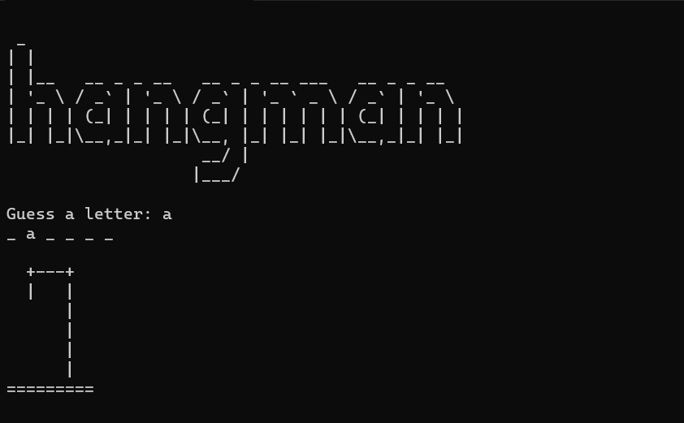

# Hangman Game

Welcome to the classic Hangman game implemented in Python! Guess letters, avoid losing lives, and try to uncover the hidden word.

## How to Play
1. Clone the repository: `git clone https://github.com/jaiswalism/hangman.git`
2. Run the Python script: `python hangman.py`
3. Input single letters to guess the word.

## Try it on Replit

Enjoy the game!

---
